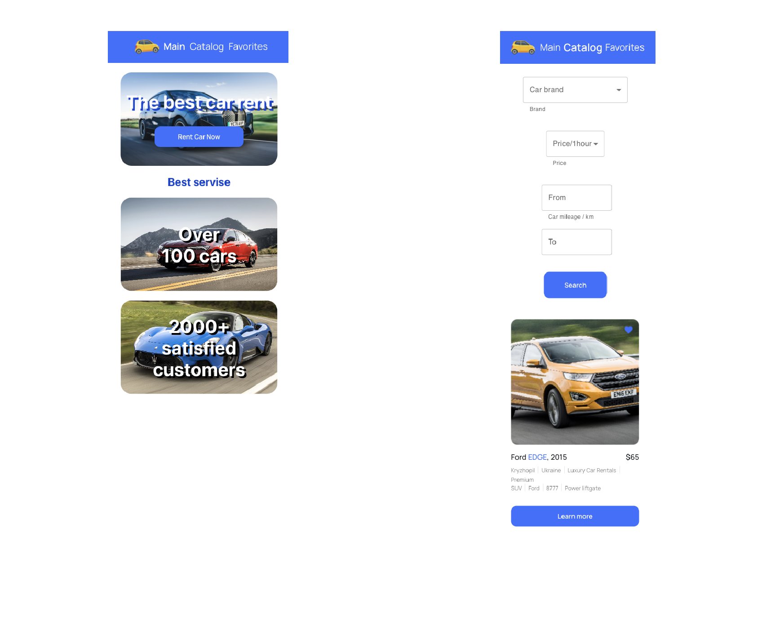
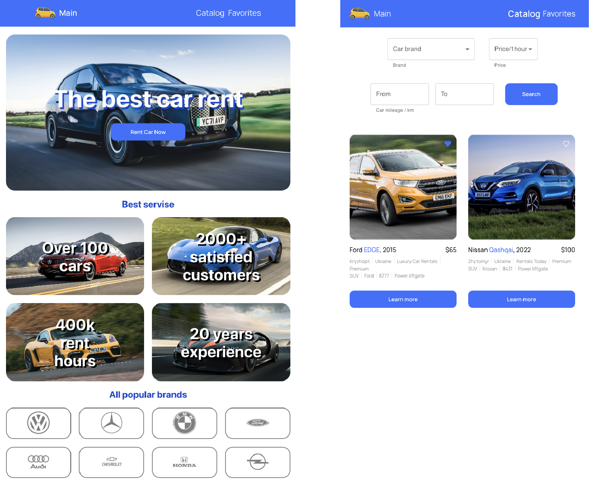
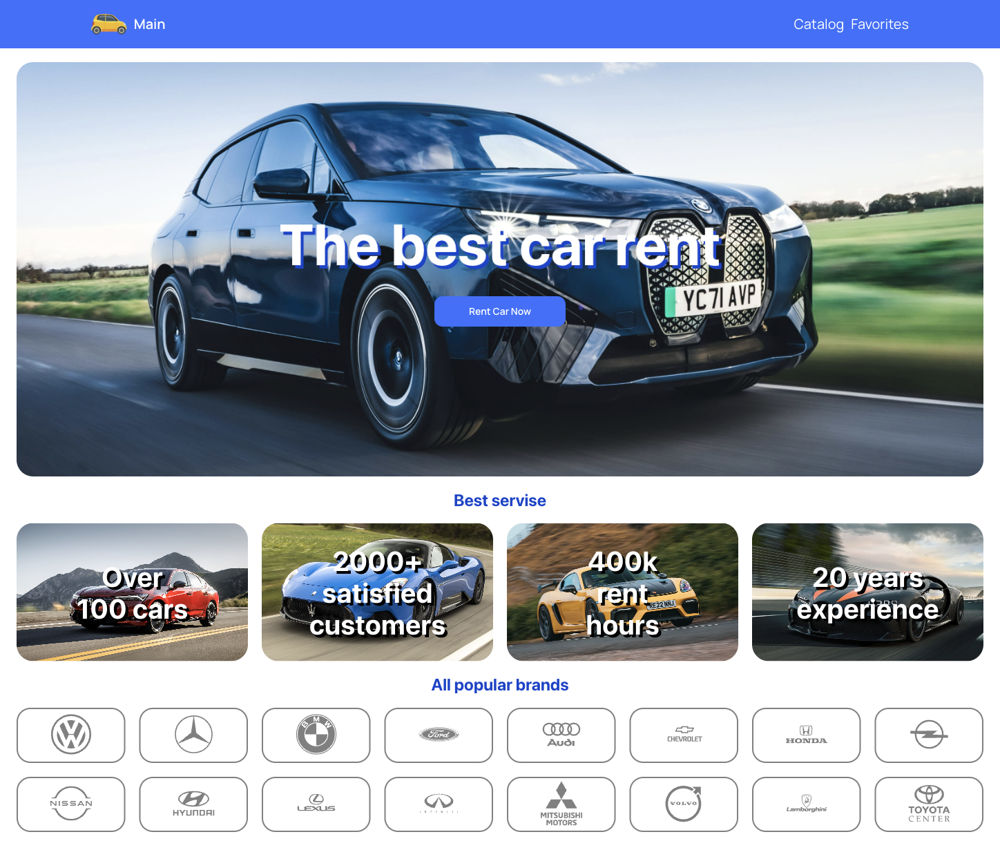
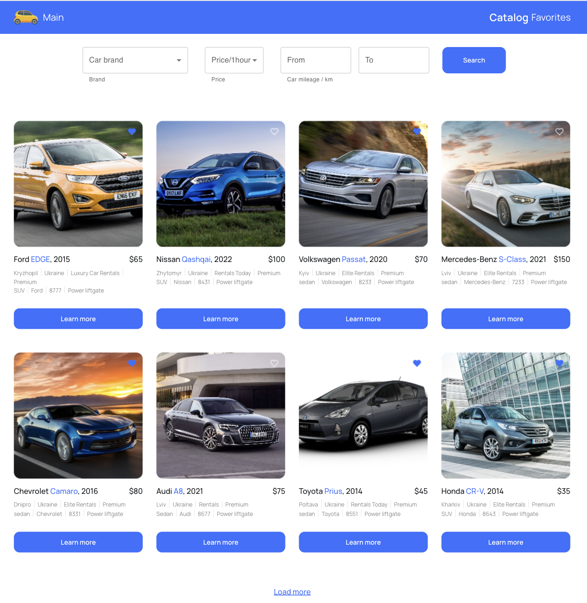
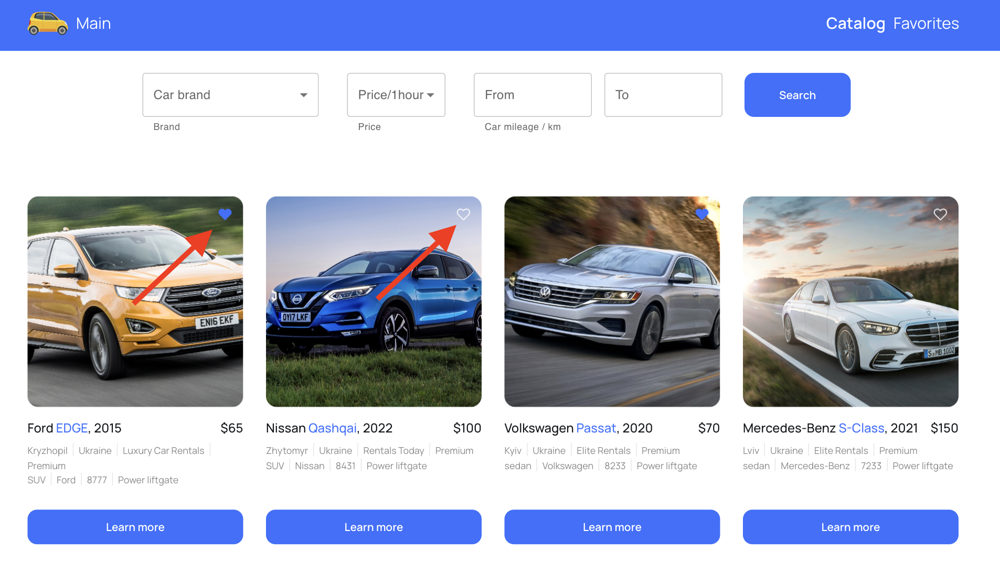
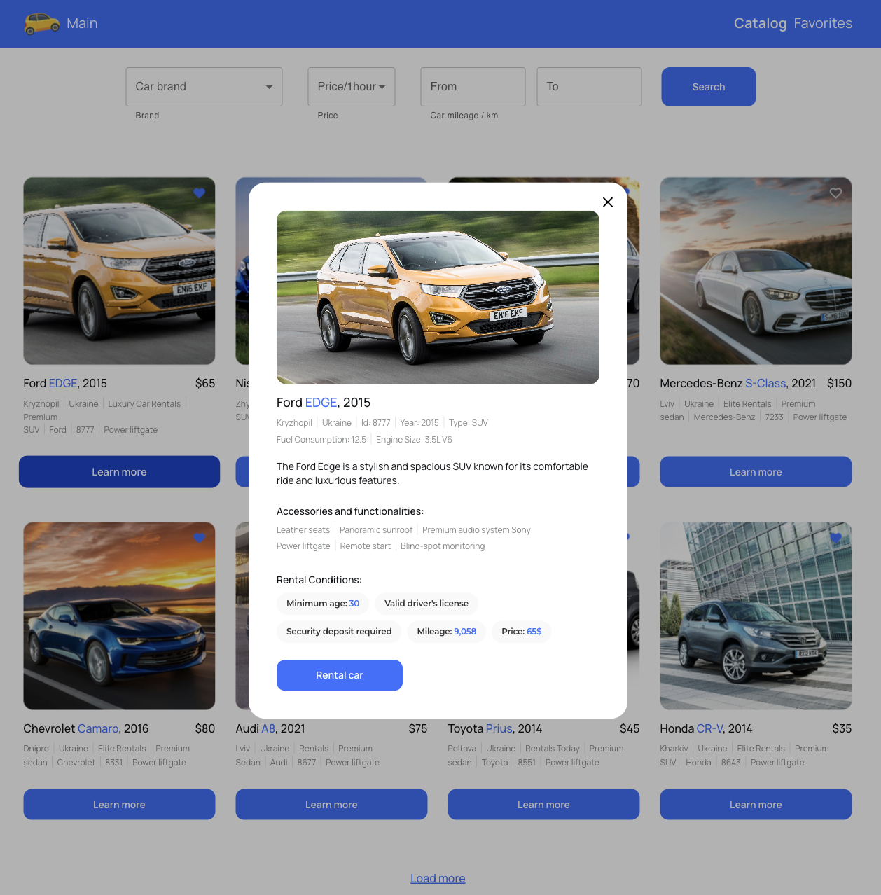
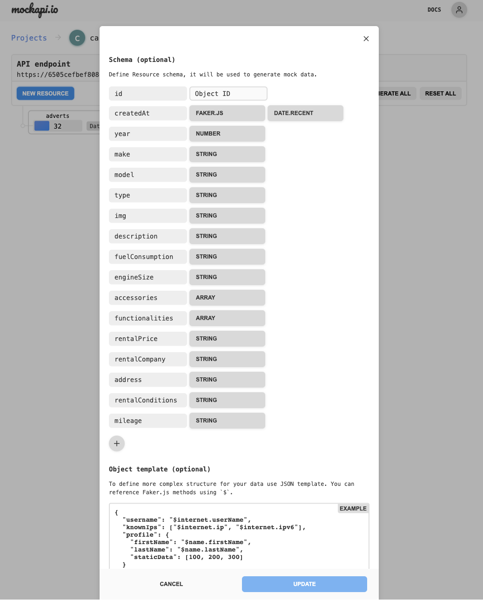
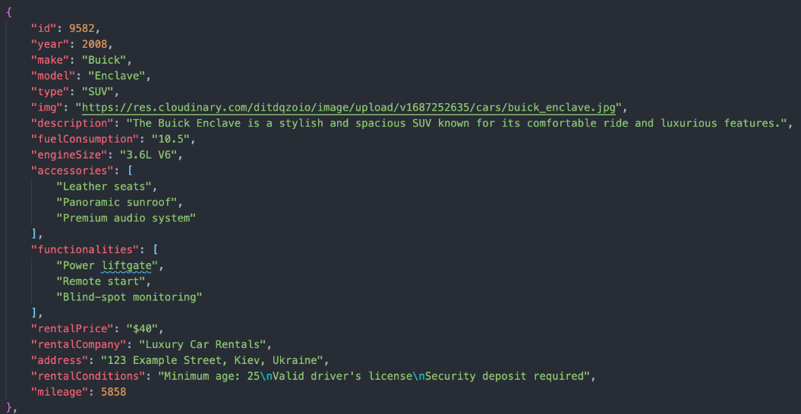

# Car Rent Service App

This is a website for Car Rent Services. It consists of:

- Main landing page about services
- Catalog page where users can choose cars
- Favorites page with a list of favorite cars

# Layout

The layout of this Application is adaptive for mobile, tablet, and desktop
devices. Design changes on the width 768px and 1440px.

## Mobile Main and Catalog Page

## Tablet Main and Catalog Page

## Desktop Main Page

## Desktop Catalog Page

## Functionality

On all pages, there is a Header and Footer for Navigation on the website and
information about the developer on any page.

On the main page, there is a Hero Section with the button for a call to Car Rent
service, the main benefits of the company, popular car logos, and a gallery with
our cars.

On the catalog page, there is a list of cars for rent with pagination. To load
more cars, press "Load more". If there are no more cars, this button is hidden.
On the top of this page is a filter search by car mark, price, and mileage. You
can choose any filter combination. If one filter is not filled, it is just
ignored. For a new search, just change the request and click "Search" again.

You can add or remove a car to/from your favorite list - just click on the heart
icon.

If you press the "Learn more" button, there is an enable modal window about car
characteristics. To close this modal window - just click the cross button,
backdrop, or Escape key on the keyboard.

On the favorite Page, you can see all cars added to your favorite. The list of
cars is located in the local storage.

# For Developers

This project is developed with
[Create React App](https://github.com/facebook/create-react-app).

## Copy of project

1. Make a copy of this project.
2. Don't forget in properties allow git-hub-actions.
3. Clone the project to your computer
4. Install all dependencies with: `npm i`
5. Change project name and username in package.json in fields "name" and
   "homepage"
6. in index.js write the correct basename="/car-rent" of your project with /
   (slash)
7. Pull your changes to GitHub
8. For deploying, you can use gh-pages.
9. To start your project, use the command: `npm start`

## Backend

For backend, we can use UI-service https://mockapi.io/. Create advert в Mockapi
with the next fields: id, year, make, model, type, img, description,
fuelConsumption, engineSize, accessories, functionalities, rentalPrice,
rentalCompany, address, rentalConditions, mileage.

 
